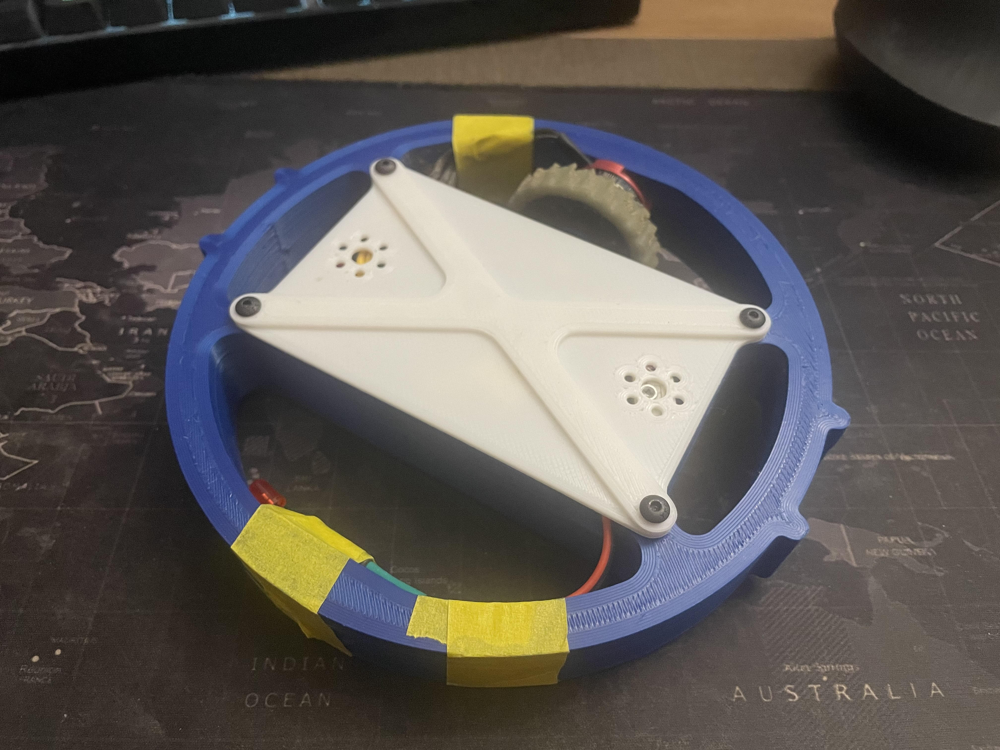

# Brain Soup v0 #

Brain Soup is a PLA 1lb antweight (Plant) meltybrain based on the ESP32 controller. The name is supposed to be temporary, but it is growing on me in time.

## Design Criteria and Overview ##

My friends said I couldn't make one in two weeks, so I did it. I also impulse bought a bunch of ESP32C3 by accident and really wanted to use them for something. Somewhere along the way, I also decided that this challenge was not hard enough, so I commited to only using ESP-IDF (no arduino as a component allowed).

With these powerful justifications in hand I set out to build a small meltybrain. I set a few simple goals for this:
1. Use only the ESP-IDF
2. Play around with ELRS
3. Have a functioning platform in 2 weeks

## Physcial Design ##
### Chassis ###
The bot chassis is just a simple ring with a box in the center and 2 replaceable impactors on each side. The diameter of the bot is the same as the Inner Diameter of my Ring Spinner, Moon Cake, so in the future, I may up this to a 3lb Beetleweight and integrate Moon Cake's weapon onto it.

### Drive ###
The bot runs 1x AKK2205 2300kv BLDC motor with a custom 1-7/8in OD 30A polyurethane wheel with the motor mounted on the outside of the ring. These are not ideal parts for the bot, but it was what I had on hand with spares: The motors were for a flywheel flipper, and the tires are spares from Moon Cake.

The reasoning for the outter ring mounting is due to how the tires are mounted on the motor cans. The tires hubs are 95A TPU and are normally mounted with the Banebot T40 hubs which retain the wheels via a c-clip and flange. This flange, though, probably sufficient, is quite small, and under the expected g-forces, might fail to retain the wheels. By mounting the motors to the outer ring, the direction of centrifugal forces will push the wheels into the can, eliminating this issues. The tradeoff of this action, is the loss of nearly an inch in wheel to center of rotation radii, resulting in a much higher rpm that exceeds the acceleromter's measurement limits. For now the solution is to limit the max=rpm, however, future revisions will have better componenet matching.

### Weapon ###
A simple replaceable tooth design using a #10 screw to mount the replaceable impactors and 2 round lobs to help with alignment. The U-shape offers additional support to the impactors. The impactors should be printed sideways, such that the direction of impact forces is normal to the layers.

## Electronic Design ##
The current temporary solutions is mounting the accelerometer, ESP32C3, and periperal connects to a breadboard (With power rails removed). The future plan is to have custom PCBs with all components integrated made, however, this is a stop-gap solution.

THe components currently in use are:
Microcontroller: [ESP32C3-Zero](https://www.aliexpress.us/item/3256806984814685.html?spm=a2g0o.order_list.order_list_main.52.326318028jwmO5&gatewayAdapt=glo2usa)
Accelerometer: [H3LIS331DL](https://learn.sparkfun.com/tutorials/h3lis331dl-accelerometer-breakout-hookup-guide/all)
BEC: [Matek BECs](https://www.amazon.com/Adjustable-Step-Down-Regulator-Quadcopter-Martian/dp/B07MS1ND5M)
Motor: [AKK2205 2300kv](https://www.amazon.com/AKK-RS2205-Brushless-2300KV-Quadcopter/dp/B07BQRGT7Q/ref=sr_1_1?crid=17NFJR02LURU5&dib=eyJ2IjoiMSJ9.QBtIv8oc_cwjyz66JMK629aizptPHuOzviAwD-WnXVytT0YmUVXHyBDeS9--9TGU0ETZJm4dyGM8YSAK49NEeA.BOj1R2SB9vsBAA7dxg4zjLoC4IKkh_DXQrjgS82ZTtg&dib_tag=se&keywords=akk+2205&qid=1741852395&sprefix=akk+2205%2Caps%2C114&sr=8-1)
ESC: [JCR Mini 35A AM32 ESC](https://justcuzrobotics.com/products/jcr-rc-mini-35a-am32-esc-brushless)
Receiver: [HGLRC ELRS 2.4GHz rx](https://www.amazon.com/HGLRC-ELRS-2-4G-Receiver-Omni-Directional/dp/B0CNRX33V6)
Battery: [Tattu 3S 550mah](https://www.amazon.com/Tattu-R-Line-550mAh-11-1V-Battery/dp/B097BVB2DT/ref=sr_1_3?crid=1CTBCWBAEBJGI&dib=eyJ2IjoiMSJ9.cYdAnWNx5mW9nKq6lmRVbL_ecY8xlypoTYX4Mg5lFhfzaF1fpWa9jBGJblj5VUAjO_uCQfx0T-tmLMOkDrESKDTKcMnep3imjiZ4U1kZLzpIdSXH8p5TKtwpMsLNB8caiids1-FUXmS9OTD9M_KJmQYQ9Kjck9vY3SEGiqsgjJSV1QglKXlMrdgUcEV4c4MwThW92MVrmgQmqjY7KihDrsm67XFcXLg8zC5RRYquHsnbtk5GbMjTMYkZilaDPRrHY5TFv6vQM-ViUAtH1mquzh4SevaxZNILBLenHbL5kLgwq5Y0QezMBhBrQcg84Ms3M36Rw0BZ6rRCZySSs_eF15WjfFcnqB5Jf31pFe_9t9Y.G7IAnH51220AOkKTLIqyouFedGLT5Kw2iKMY3gl4iog&dib_tag=se&keywords=tattu+3s+550&qid=1741852572&s=toys-and-games&sprefix=tattu+3s+550%2Ctoys-and-games%2C96&sr=1-3)

## Software Design ##
The software is written using the ESP-IDF with modified/ adapted arduino libraries. The firmware takes in CRSF inputs from the receiver, acceleration data from the accelerometer, and outputs 3D dshot600 packets using the ESP RMT components to control the motor ESC (set to 3D/bidirectional drive).

The implementation of the melty drive is based on openmelt, where motor and LED timings are calculated at the start of each full rotation. When the spin_once() function is call, it will read the current accelerometer output using this calculate the current rpm and rotational internal. Knowing the period for one full rotation, ON, IDLE, and OFF intervals are calculated for both the motor and LED. These intervals can be viewed as 4 sections of the full 360 degree rotation. An idle section at the start and middle of the full spin, and two sections where the motors rotating in opposite directions. These changing throttles produce a Net forward or backwards direction where the left-right force cancel out.

The implementation of steering during melty drive is done via cumulative drift. The turning functions by artificially lengthening or shortening the real period for each spin AFTER all intra-spin calculations have been made. Such that all timing calculations and timings are done with the observed period, but run under the modified period. The difference between the modified and observed periods introduces a controlled error favoring a direction depending on the sign. For example, given a CW spinning melty with a rotational period of 10 sec (6 rpm). If we lengthen the period by 10% or +1sec, the melty will do its normal operations based on the original 10s period, but the next spin-check will be delayed by 1sec or 10% of a rotation (ie 36 deg). This delay will cause the next spin-check to be 1sec. The effect is that the heading has "turned" 36 deg CW from the previous heading. This also works in the opposite direction, but instead -1sec or -10%.

This steering implementation is simple, but the turning speed is relative to the RPM, ie rad/s = turn% * rps. Thus at higher rpms, the turing rates may be annoying to handle, but this can be solved with simple scaling.

# Current Status #
The bot currently functions as intended, however, I am unable to do too much testing with it at the moment. My testbox is small and does not offer enough room for the Melty to manuver and the current state of the wiring is something that desires improvement. My current plans are to design a custom PCB with all the componenet integrated to minimize wire mess, and bring the bot to locals with larger testboxes to conduct deeper testing.
